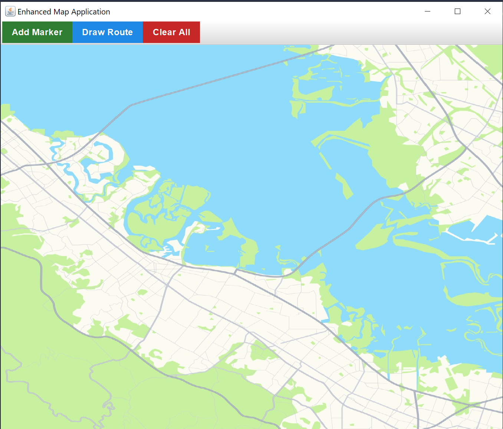
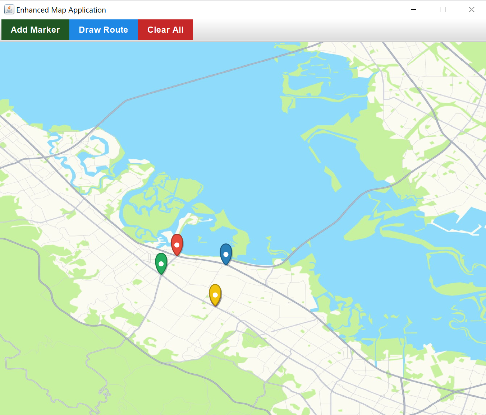
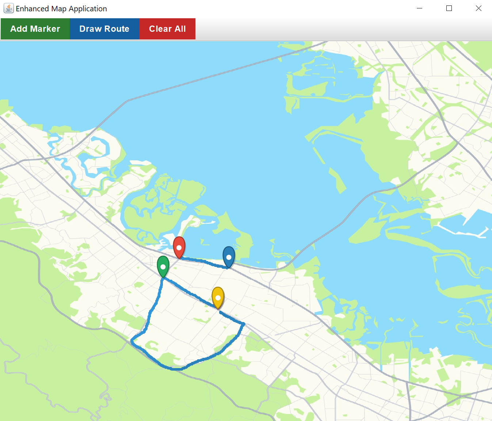

# Route Planner 🗺️✏️

An interactive Java Swing application for planning and visualizing routes on a map with customizable markers and paths.

## Features

- 🖌️ **Interactive Drawing**:
  - Add colored location markers
  - Draw custom routes with click-and-drag
- 🎨 **Visual Customization**:
  - Gradient-colored routes
  - Stylish location pins
  - Custom map background support
- 🧹 **Easy Management**:
  - Clear all markers/routes with one click
  - Mode switching between markers and routes
- 📐 **Visual Aids**:
  - Automatic grid when no background image
  - Smooth anti-aliased rendering

## How to Run

1. **Run the application**:

   ```bash
   javac RoutePlanner.java
   java RoutePlanner
   ```

2. **Use Map Features**:

   - Left-click to add markers (in marker mode)
   - Click-drag to draw routes (in route mode)
   - Automatically saves completed routes

## Example Output




